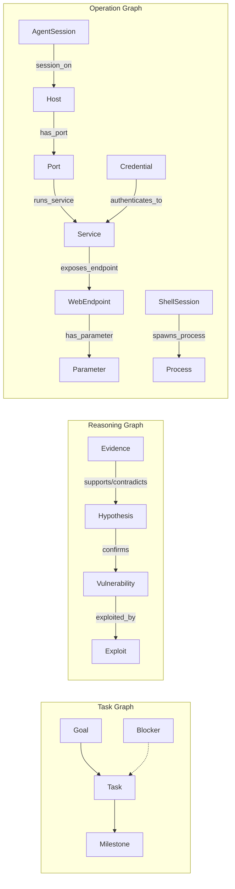

# AdversaryChefAgentTeam 增强方案 — 综合研究报告

> **研究日期**: 2026-07-25
> **研究对象**: AdversaryChefAgentTeam (ACA) + 4 个参考项目
> **核心问题**: 如何结合 Multica 原生 Squad 机制 + Clinkz/LuaN1aoAgent 架构思路 + 现有 asset-mcp，
> 将 8 个专精 Agent 从"松散集合"升级为"协同作战小队"？

---

## 目录

1. [摘要：4 个参考项目的可借鉴点](#1-摘要4-个参考项目的可借鉴点)
2. [核心洞察 #1：ACA 与 Multica Squad 的天然契合](#2-核心洞察-1aca-与-multica-squad-的天然契合)
3. [核心洞察 #2：LuaN1aoAgent 三图架构如何映射到 ACA](#3-核心洞察-2luan1aoagent-三图架构如何映射到-aca)
4. [核心洞察 #3：Artifact Store 替代"Agent 上下文膨胀"](#4-核心洞察-3artifact-store-替代agent-上下文膨胀)
5. [增强方案：Multica Squad + asset-mcp 增强 + knowledge-mcp](#5-增强方案multica-squad--asset-mcp-增强--knowledge-mcp)
6. [实施路线图（含 Multica Squad 配置）](#6-实施路线图含-multica-squad-配置)

---

## 1. 摘要：4 个参考项目的可借鉴点

| 参考项目 | 核心创新 | 可借鉴点 | 优先级 |
|----------|---------|---------|--------|
| **Clinkz** | MessageBus + 双层 DB + Capability Recall | knowledge-mcp 跨项目能力记忆 | ⭐⭐⭐ |
| **LuaN1aoAgent** | 三图 (Task/Reasoning/Operation) + Artifact Store + P-E-O | asset-mcp 数据模型升级为三图；大文件存 Artifact | ⭐⭐⭐⭐⭐ |
| **Multica** | Squad Leader-Worker 协议 + Briefing + 技能可见性 | AC-Supervisor 升级为真正的 Squad Leader | ⭐⭐⭐⭐⭐ |
| **上一轮研究** | Session 共享 + Endpoint 状态机 + 实时事件 | 已在 asset-mcp 增强方案中覆盖 | ⭐⭐⭐ |

> **核心结论**: 两个"即战力"提升和一个"架构升级"：
> 1. **即战力 #1**: 用 Multica Squad 原生机制替代当前手动的 Supervisor→Agent 调度
> 2. **即战力 #2**: asset-mcp 数据模型从 5 个平表升级为 Operation Graph + Session 表
> 3. **架构升级**: 引入 knowledge-mcp 实现跨项目能力记忆

---

## 2. 核心洞察 #1：ACA 与 Multica Squad 的天然契合

### 2.1 当前 ACA 的调度方式（手动）

```
用户 → AC-Supervisor（via Multica Issue）
         │
         │ 手动 classify → dispatch
         ▼
    AC-Echo    AC-Breach    AC-Ghost    ...
```

**问题**：
- Supervisor 在 prompt 中写了 task classification 表和 dispatch 规则，但**每次都要手动通过 Multica issue 创建子 Issue**
- Agent 之间的结果传递依赖 Supervisor 手动读取→汇总→再分发
- Supervisor 不知道 worker 的技能、状态、活跃任务

### 2.2 Multica Squad 的 Leader-Worker 协议

Multica Squad 原生提供了一套完整的 Leader-Worker 协作机制：

```
Issue 被 assign 给 Squad → Leader Agent 被自动触发
                              │
                    ┌─────────┴─────────┐
                    │  Squad Briefing   │   ← 自动注入！
                    │  (Roster + Rules) │
                    └─────────┬─────────┘
                              │
                    Leader 阅读 Issue
                    Leader 选择 Worker → @mention
                              │
                    ┌─────────┴─────────┐
                    │  Worker 被 @触发    │
                    │  Worker 执行任务    │
                    │  Worker 回复 comment│
                    └─────────┬─────────┘
                              │
                    Leader 被自动 re-trigger
                    Leader 评估 → 继续/关闭
```

**Squad Briefing 自动注入的内容**：

```markdown
## Squad Operating Protocol
1. Read the issue — decide which squad member is best suited
2. Delegate by @mention → [@AC-Echo](mention://agent/<UUID>)
3. Record evaluation: `multica squad activity <issue-id> <outcome>`
4. Stop after dispatching — you will be re-triggered automatically
5. Re-evaluate on each trigger

## Squad Roster
Leader (you):
- AC-Supervisor — agent — `[@AC-Supervisor](mention://agent/<id>)`

Members:
- AC-Echo — agent, role: "recon", skills: port-scanning,web-probing,js-analysis — `[@AC-Echo](mention://agent/<id>)`
- AC-Breach — agent, role: "exploit", skills: sqli,rce,deserialization — `[@AC-Breach](mention://agent/<id>)`
- AC-Ghost — agent, role: "c2-operator" — `[@AC-Ghost](mention://agent/<id>)`
- AC-Path — agent, role: "lateral-movement" — `[@AC-Path](mention://agent/<id>)`
- AC-Forge — agent, role: "infrastructure" — `[@AC-Forge](mention://agent/<id>)`
- AC-Strategist — agent, role: "planner" — `[@AC-Strategist](mention://agent/<id>)`
- AC-Quill — agent, role: "reporter" — `[@AC-Quill](mention://agent/<id>)`

## Squad Instructions (攻防厨师团)
- project_id: <current>
- Scope: <from issue>
- asset-mcp available at http://asset-mcp:8081
```

### 2.3 ACA 适配方案

**改造前**（当前手动方式）：
```
用户 Issue: "对 target.com 进行完整渗透"
→ AC-Supervisor 手动 classify
→ AC-Supervisor 手动创建子 Issue: "AC-Strategist: 制定攻击计划"
→ AC-Strategist 回复计划
→ AC-Supervisor 手动创建子 Issue: "AC-Echo: 侦察 target.com"
→ ...循环...
```

**改造后**（Multica Squad 原生机制）：
```
用户 Issue: "对 target.com 进行完整渗透" (assignee: 攻防厨师团 Squad)
→ Squad Leader (AC-Supervisor) 自动被触发
→ Squad Briefing 自动注入（Roster + 规程）
→ AC-Supervisor 阅读 Issue + 现有 Findings
→ AC-Supervisor @mention AC-Strategist: "制定攻击计划"
→ AC-Strategist 被自动触发 → 查询 asset-mcp → 回复计划
→ AC-Supervisor 被自动 re-trigger
→ AC-Supervisor @mention AC-Echo: "按计划侦察 Phase 1"
→ ...自动循环...
```

**关键收益**：
- **零调度代码**：不需要在 Supervisor prompt 中写入 dispatch 逻辑，Multica Squad 协议自动处理
- **自动 re-trigger**：Worker 完成任务后 Leader 自动被唤醒，不需要手动轮询
- **技能可见**：Leader 能看到每个 worker 绑定的 skills，可以智能分派
- **操作审计**：`multica squad activity` 自动记录每次 leader 决策

### 2.4 Squad 配置指南

```bash
# 1. 创建 Squad
multica squad create \
  --name "攻防厨师团" \
  --description "8-agent red team squad for full attack lifecycle" \
  --leader-id <AC-Supervisor-agent-id>

# 2. 添加成员 + 角色 + 技能描述
multica squad members add <squad-id> \
  --member-type agent --member-id <AC-Strategist-id> --role "攻击策略师"
multica squad members add <squad-id> \
  --member-type agent --member-id <AC-Echo-id> --role "侦察兵"
# ... 添加所有 7 个成员

# 3. 配置 Squad Instructions（作为 Briefing 的一部分自动注入）
multica squad update <squad-id> --instructions '
## Rules of Engagement
- project_id 必须透传到所有子任务
- asset-mcp 地址: http://asset-mcp:8081
- kali-mcp 地址: http://kali-mcp:8080
- mythic-mcp 地址: http://mythic-mcp:8082

## Tool Escalation Policy
- 🟢 Passive: 所有 agent 自主
- 🟡 Active: agent 在授权范围内自主
- 🔴 Intrusive: 必须 Leader 明确批准

## Agent Selection Guide
- 侦察 → AC-Echo
- 漏洞验证 → AC-Breach
- C2 操作 → AC-Ghost
- 内网移动 → AC-Path
- 基础设施 → AC-Forge
- 报告生成 → AC-Quill
- 攻击规划 → AC-Strategist
'
```

---

## 3. 核心洞察 #2：LuaN1aoAgent 三图架构如何映射到 ACA

### 3.1 LuaN1aoAgent 的三图模型

LuaN1aoAgent 使用三种图来分离不同的知识领域：



**三种图的关系**：
- **Task Graph**：Planner 管理，"要做什么"
- **Reasoning Graph**：Projector 从 ExecutionLog 异步构建，"发现了什么，为什么"
- **Operation Graph**：Projector 从 ExecutionLog 异步构建，"目标长什么样，怎么连接的"

**Evidence 是连接三种图的桥梁**：每个 GraphNode 都有 `evidenceRefs[]`，指向 ExecutionLog 中的事件。

### 3.2 ACA 当前数据模型 vs 三图模型

| LuaN1ao 图 | 节点类型 | ACA 当前等价物 | 差距 |
|-----------|---------|---------------|------|
| Task Graph | Goal, Task, Milestone, Blocker | Multica Issue 系统 | ✅ 已由 Multica 覆盖 |
| Reasoning Graph | Evidence→Hypothesis→Vulnerability→Exploit | Clue (仅有 Type/Status) | ❌ 无推理链 |
| Operation Graph | Host, Port, Service, WebEndpoint, Parameter, Credential, AgentSession, ShellSession | Asset + Credential (扁平) | ❌ 缺少关系边 |

### 3.3 asset-mcp 数据模型升级提案

**从平表升级为图**：

```go
// ── Operation Graph 节点类型 ──

// Host 节点（替代 Asset.IPs）
type HostNode struct {
    ID        string   `json:"id"`
    ProjectID string   `json:"project_id"`
    IPs       []string `json:"ips"`
    Hostname  string   `json:"hostname,omitempty"`
    OS        string   `json:"os,omitempty"`
    // --- 图元字段 ---
    GraphKind string   `json:"graph_kind"`  // "operation"
    NodeType  string   `json:"node_type"`   // "Host"
    EvidenceRefs []string `json:"evidence_refs,omitempty"`
}

// Service 节点（端口上的服务）
type ServiceNode struct {
    ID        string `json:"id"`
    ProjectID string `json:"project_id"`
    HostID    string `json:"host_id"`       // 通过 has_port 边关联
    Port      int    `json:"port"`
    Protocol  string `json:"protocol"`      // tcp/udp
    Name      string `json:"name"`          // http/ssh/mysql/...
    Version   string `json:"version,omitempty"`
    Banner    string `json:"banner,omitempty"`
    GraphKind string `json:"graph_kind"`
    NodeType  string `json:"node_type"`     // "Service"
    EvidenceRefs []string `json:"evidence_refs,omitempty"`
}

// WebEndpoint 节点（HTTP 端点）
type WebEndpointNode struct {
    ID         string   `json:"id"`
    ProjectID  string   `json:"project_id"`
    ServiceID  string   `json:"service_id"`  // 通过 exposes_endpoint 边关联
    URL        string   `json:"url"`
    Method     string   `json:"method"`
    Parameters []string `json:"parameters,omitempty"`
    Status     string   `json:"status"`      // discovered/testing/tested/skipped
    DiscoveredBy string `json:"discovered_by"`
    TestedBy   string   `json:"tested_by,omitempty"`
    GraphKind  string   `json:"graph_kind"`
    NodeType   string   `json:"node_type"`   // "WebEndpoint"
    EvidenceRefs []string `json:"evidence_refs,omitempty"`
}

// ── Reasoning Graph 节点类型 ──

// Evidence 节点（扫描结果、工具输出、响应包等具体证据）
type EvidenceNode struct {
    ID          string `json:"id"`
    ProjectID   string `json:"project_id"`
    Label       string `json:"label"`        // 简要描述
    ContentHash string `json:"content_hash"` // 源内容的 hash（指向 Artifact）
    SourceEvent string `json:"source_event"` // 来源事件 ID
    GraphKind   string `json:"graph_kind"`   // "reasoning"
    NodeType    string `json:"node_type"`    // "Evidence"
}

// Hypothesis 节点（基于 Evidence 的推测）
type HypothesisNode struct {
    ID          string `json:"id"`
    ProjectID   string `json:"project_id"`
    Label       string `json:"label"`        // e.g. "可能存在 SQL 注入"
    Confidence  float64 `json:"confidence"`  // 0..1
    Status      string `json:"status"`       // proposed/testing/confirmed/rejected
    GraphKind   string `json:"graph_kind"`   // "reasoning"
    NodeType    string `json:"node_type"`    // "Hypothesis"
    EvidenceRefs []string `json:"evidence_refs"`
}

// Vulnerability 节点（已确认的漏洞，升级自 Hypothesis）
type VulnerabilityNode struct {
    ID          string `json:"id"`
    ProjectID   string `json:"project_id"`
    Label       string `json:"label"`        // e.g. "SQL Injection in /api/login"
    CVE         string `json:"cve,omitempty"`
    Severity    string `json:"severity"`     // critical/high/medium/low
    CVSS        float64 `json:"cvss,omitempty"`
    Description string `json:"description"`
    Remediation string `json:"remediation,omitempty"`
    GraphKind   string `json:"graph_kind"`   // "reasoning"
    NodeType    string `json:"node_type"`    // "Vulnerability"
    EvidenceRefs []string `json:"evidence_refs"` // 必须！无证据不能创建
}

// ── 图边 ──
type GraphEdge struct {
    ID        string `json:"id"`
    ProjectID string `json:"project_id"`
    FromID    string `json:"from_id"`   // source node
    ToID      string `json:"to_id"`     // target node
    EdgeType  string `json:"edge_type"` // supports/contradicts/confirms/has_port/...
    EvidenceRefs []string `json:"evidence_refs,omitempty"`
}

// ── Session 节点（跨 Agent 会话共享）─
type SessionNode struct {
    ID           string `json:"id"`
    ProjectID    string `json:"project_id"`
    AssetID      string `json:"asset_id"`       // 关联到哪个 Host/Service
    CreatedBy    string `json:"created_by"`     // 哪个 Agent 创建的
    URL          string `json:"url"`
    CookiesJSON  string `json:"cookies_json"`
    TokenValue   string `json:"token_value,omitempty"`
    SessionType  string `json:"session_type"`   // web/c2_shell/ssh/tunnel
    GraphKind    string `json:"graph_kind"`     // "operation"
    NodeType     string `json:"node_type"`      // "Session"
    EvidenceRefs []string `json:"evidence_refs,omitempty"`
}
```

### 3.4 图操作的 MCP Tools 设计

```go
// 新增 MCP Tools（在 asset-mcp 中）
// 节点 CRUD
"create_host"       — 创建 Host 节点（IP/域名/OS）
"create_service"    — 创建 Service 节点（端口+协议+版本）
"create_endpoint"   — 创建 WebEndpoint 节点（URL+Method+参数，唯一约束去重）
"create_evidence"   — 创建 Evidence 节点
"create_hypothesis" — 创建 Hypothesis 节点
"create_vulnerability" — 创建 Vulnerability 节点（必须携带 evidence_refs）
"create_session"    — 创建 Session 节点

// 边 CRUD
"create_edge"       — 创建图边（has_port/exposes_endpoint/supports/confirms/...）

// 图查询
"graph_query"       — 从某个节点出发，遍历 N 跳获取子图
"graph_trace"       — 反向追溯：给定 Vulnerability → 关联的 Hypothesis → Evidence → 源事件
"find_untested"     — 查询 status=discovered 的 Endpoint
"find_sessions"     — 查询可用的 Session（用于跨 Agent 认证态传递）
```

### 3.5 Agent 如何使用图模型

**AC-Echo（侦察兵）**：
```
发现 10.0.0.5 开放 80 端口:
  → create_host(10.0.0.5, hostname="web01")
  → create_service(port=80, protocol="tcp", name="http", version="Apache 2.4.51")
  → create_edge("has_port"): Host(10.0.0.5) → Service(:80)
  → create_endpoint(URL="/api/login", method="POST", params=["user","pass"])
  → create_evidence(label="nmap scan result", content_hash="sha256:xxx")
  → create_hypothesis("可能存在默认凭据", confidence=0.3)
```

**AC-Breach（漏洞手）**：
```
查询后利用:
  → graph_query(from=Service(:80), depth=2) → 获取所有 endpoint
  → find_untested() → 获取 status=discovered 的端点
  → 利用 SQLi 成功:
    → create_hypothesis("SQLi confirmed", status="confirmed")
    → create_vulnerability("SQL Injection in /api/login", severity="critical", 
                           evidence_refs=["evt_001","evt_002"])
    → create_edge("confirms"): Hypothesis → Vulnerability
```

**AC-Quill（报告员）**：
```
生成报告:
  → graph_trace(vulnerability_id="vuln_001") → 获取完整推理链
  → Evidence → Hypothesis → Vulnerability → Exploit
  → 自动生成有证据支撑的漏洞报告
```

---

## 4. 核心洞察 #3：Artifact Store 替代"Agent 上下文膨胀"

### 4.1 LuaN1aoAgent 的 Artifact Store 设计

LuaN1aoAgent 面临的核心问题：Agent 的工具输出可能很大（nmap 扫描结果、目录爆破输出、截图等），如果全部放入 Agent 上下文，会快速耗尽 token 预算。

**解决方案**：Content-Addressed Artifact Store

```
Tool Output > 阈值?
  ├── ≤ 阈值 → inline（直接放入 Agent 上下文）
  └── > 阈值 → 写入 Artifact Store → 返回 preview(800 bytes) + artifactRef
```

**Artifact 特性**：
- **内容寻址**：SHA256 hash 作为文件名，自动去重
- **不可变**：创建后不可修改
- **Preview**：前 800 字节作为预览，Agent 可以快速浏览
- **按需加载**：`artifact_read(artifactRef, {offset, length})` 分段读取
- **跨任务共享**：多个 Executor 可以共享同一个 Artifact

### 4.2 ACA 的应用场景

| 场景 | 输出大小 | 当前处理 | 优化后 |
|------|---------|---------|--------|
| nmap 扫描 1000 端口 | ~100KB | 全部塞入 Agent 上下文 | → Artifact，preview 前 800B |
| gobuster 目录爆破 | ~50KB | 全部塞入 Agent 上下文 | → Artifact，preview 前 800B |
| JS bundle 分析 | ~500KB | Agent 上下文炸裂 | → Artifact，按需 `artifact_read` |
| sqlmap 输出 | ~200KB | 部分截断 | → Artifact + preview |
| nuclei 扫描结果 | ~300KB | 无法放入上下文 | → Artifact + structured preview |
| Mythic callback 截图 | ~1MB | 无法传递 | → Artifact + MIME type 标记 |

### 4.3 asset-mcp 中的 Artifact 实现

```go
type Artifact struct {
    ID           string `json:"id"`
    ProjectID    string `json:"project_id"`
    ContentHash  string `json:"content_hash"`  // SHA256
    MediaType    string `json:"media_type"`    // text/plain, image/png, application/json
    ByteLength   int64  `json:"byte_length"`
    Preview      string `json:"preview"`       // 前 800 字节
    CreatedBy    string `json:"created_by"`    // 哪个 Agent 创建的
    CreatedAt    time.Time `json:"created_at"`
}

// 新增 MCP Tools
"artifact_write" — 写入 Artifact（自动去重，返回 artifactRef + preview）
"artifact_read"  — 按偏移量/长度分段读取 Artifact 内容
"artifact_list"  — 列出项目下的所有 Artifact
"artifact_search"— 全文搜索 Artifact 内容
```

**Agent prompt 中的使用规范**：
```markdown
## Artifact Protocol
- 任何工具输出超过 2000 字符时，使用 artifact_write 保存
- 对其他 Agent 产生的 Artifact，使用 artifact_read 按需读取
- 不要将整个 Artifact 复制到你的回复中——引用 artifact_id 即可
- artifact_read 支持 offset/length 参数，用于大文件分段读取
```

---

## 5. 增强方案：Multica Squad + asset-mcp 增强 + knowledge-mcp

### 5.1 最终架构

```
┌─────────────────────────────────────────────────────────────┐
│                    Multica Platform                          │
│  ┌─────────────────────────────────────────────────────────┐│
│  │  Squad: 攻防厨师团                                       ││
│  │  Leader: AC-Supervisor (自动触发 + @mention 调度)        ││
│  │  Workers: AC-Strategist/Echo/Breach/Ghost/Path/Forge/Quill││
│  │  Protocol: Squad Operating Protocol (自动注入)           ││
│  │  Briefing: Roster + Instructions + Skills                ││
│  └─────────────────────────────────────────────────────────┘│
└──────────────────────────┬──────────────────────────────────┘
                           │
┌──────────────────────────▼───────────────────────────────────┐
│               asset-mcp (共享数据层 — HTTP/SSE)               │
│  ┌─────────────────────────────────────────────────────────┐│
│  │ Operation Graph: Host → Service → Endpoint → Parameter   ││
│  │                   Credential → Session                   ││
│  │ Reasoning Graph: Evidence → Hypothesis → Vulnerability   ││
│  │ Artifact Store:  Content-addressed, 不可变, 按需读取      ││
│  └─────────────────────────────────────────────────────────┘│
└──────────────────────────┬───────────────────────────────────┘
                           │
┌──────────────────────────▼───────────────────────────────────┐
│            knowledge-mcp (跨项目知识层 — 去目标化)             │
│  ┌─────────────────────────────────────────────────────────┐│
│  │ capability_facts: 技术栈-能力映射                         ││
│  │ technique_results: 利用技巧-结果映射                      ││
│  │ topology_edges: 跨服务拓扑关系                            ││
│  └─────────────────────────────────────────────────────────┘│
└──────────────────────────────────────────────────────────────┘
```

### 5.2 数据流示例：一次完整的渗透任务

```
Step 1: 用户创建 Issue，assignee = 攻防厨师团 Squad
        Issue: "对 target.com (project_id: proj_001) 进行完整渗透"

Step 2: Multica 自动触发 Squad Leader (AC-Supervisor)
        → 自动注入 Squad Briefing (Roster + Instructions)
        → AC-Supervisor 读取 Issue + asset-mcp 状态

Step 3: AC-Supervisor → @mention AC-Strategist: "制定攻击计划"
        → AC-Strategist 被自动触发
        → AC-Strategist 查询 asset-mcp: graph_query(project_id=proj_001)
        → AC-Strategist 查询 knowledge-mcp: search_capabilities("target.com 技术栈")
        → AC-Strategist 回复攻击计划 (Phase 1: Recon, Phase 2: Exploit, ...)

Step 4: AC-Supervisor 被自动 re-trigger
        → 读取 AC-Strategist 的计划
        → @mention AC-Echo: "Phase 1 Recon: target.com"

Step 5: AC-Echo 执行侦察
        → nmap 结果 → artifact_write(跳过 preview 800B)
        → 发现 :80 Apache 2.4.51
          → create_host("target.com", IPs=["10.0.0.5"])
          → create_service(port=80, name="http", version="Apache 2.4.51")
          → create_edge("has_port"): Host → Service
          → create_evidence("nmap scan", content_hash="sha256:xxx")
        → gobuster 目录爆破 → artifact_write
          → create_endpoint("/api/login", "POST", ["user","pass"])
          → ...继续添加更多 endpoint
        → JS 分析 → artifact_write(JS bundle)
          → create_endpoint("/api/internal/users", "GET")
        → 回复 AC-Supervisor: "侦察完成。发现 3 个服务和 12 个端点。"

Step 6: AC-Supervisor 被自动 re-trigger
        → 读取 AC-Echo 的发现
        → @mention AC-Breach: "验证以下端点: /api/login (POST), /api/internal/users (GET)"

Step 7: AC-Breach 执行利用
        → find_untested() → 获取端点列表
        → 测试 /api/login → 发现 SQLi
          → create_hypothesis("SQLi in /api/login", confidence=0.8)
          → create_evidence("sqlmap output", content_hash="sha256:yyy")
          → sqlmap 输出 → artifact_write
        → 利用成功
          → create_vulnerability("SQL Injection in /api/login", severity="critical",
                                 evidence_refs=["evt_001","evt_002"])
          → create_edge("confirms"): Hypothesis → Vulnerability
        → 获取 web shell 凭据
          → create_credential(type="webshell", label="target.com webshell", 
                              value="http://target.com/shell.php?pass=xxx")
          → create_session(type="web", url="http://target.com/shell.php", ...)
        → 回复 AC-Supervisor: "确认 SQLi，已获取 webshell。Session 已保存。"

Step 8: AC-Supervisor 被自动 re-trigger
        → 读取 AC-Breach 的成果
        → @mention AC-Ghost: "在 target.com 部署 C2。Webshell: session_id=sess_001"

Step 9: AC-Ghost 部署 C2
        → find_sessions() → 获取 webshell session
        → 部署 Mythic agent
        → 创建 Session(type="c2_shell", ...)
        → 回复 AC-Supervisor: "C2 已部署。Callback ID: cb_001"

Step 10: ... (继续内网移动、报告生成等)

Step 11: AC-Quill 生成报告
         → graph_trace(project_id=proj_001) → 获取完整推理链
         → 生成最终报告
```

### 5.3 关键对比：改造前 vs 改造后

| 维度 | 改造前 | 改造后 |
|------|--------|--------|
| **调度** | Supervisor 手动 classify→dispatch→创建子 Issue | Multica Squad @mention 自动触发 |
| **Worker 触发** | 依赖 Supervisor 手动创建子 Issue 并 assign | Worker 被 @mention 自动触发 |
| **Leader 唤醒** | 无自动机制，需人工介入 | Worker 回复后 Leader 自动 re-trigger |
| **技能可见** | Leader 不知道 Worker 的能力 | Squad Roster 自动展示所有 Worker 的技能 |
| **数据模型** | 5 个平表 (Project/Asset/Clue/Credential/WorkLog) | 图模型 (Host→Service→Endpoint + Evidence→Hypothesis→Vulnerability) |
| **推理链** | 无 (Clue 只有 Type/Status) | Evidence → Hypothesis → Vulnerability → Exploit |
| **大输出处理** | 全部塞入 Agent 上下文 | Artifact Store (preview 800B + 按需分段读取) |
| **跨项目积累** | 每次渗透"冷启动" | knowledge-mcp 跨项目能力记忆 |
| **决策审计** | 无 | `multica squad activity` 强制记录 |

---

## 6. 实施路线图（含 Multica Squad 配置）

### Phase 0：Multica Squad 配置（0.5 天，无代码改动）

**Step 1**: 在 Multica 中创建 Squad
```bash
multica squad create \
  --name "攻防厨师团" \
  --description "8-agent red team squad: full attack lifecycle" \
  --leader-id <AC-Supervisor-id>
```

**Step 2**: 添加所有 Agent 为 Squad 成员
```bash
for agent in AC-Strategist AC-Echo AC-Breach AC-Ghost AC-Path AC-Forge AC-Quill; do
  multica squad members add <squad-id> \
    --member-type agent \
    --member-id $(multica agent get --name "$agent" --json | jq -r '.id') \
    --role "$(get_role $agent)"
done
```

**Step 3**: 更新 Squad Instructions
```bash
multica squad update <squad-id> --instructions '...（SOP + 工具地址 + 升级策略）...'
```

**Step 4**: 简化 AC-Supervisor prompt
- 删除手动 task classification 表
- 删除手动 dispatch 逻辑
- 替换为 Squad Leader 规程（由 Multica 自动注入）

**验证**: 创建一个测试 Issue，assign 给 Squad，观察 Leader 是否自动触发并正确 @mention 调度

### Phase 1：asset-mcp 数据模型升级（2-3 天）

| 任务 | 工作量 |
|------|--------|
| 新增 Operation Graph 节点类型（Host/Service/Endpoint/Parameter） | 1天 |
| 新增 Reasoning Graph 节点类型（Evidence/Hypothesis/Vulnerability） | 0.5天 |
| 新增 GraphEdge 表 + 图遍历查询 | 0.5天 |
| 新增 Artifact Store（content-addressed + preview + 分段读取） | 1天 |
| 新增 Session 节点（跨 Agent 会话共享） | 0.5天 |

### Phase 2：Agent Prompt 适配（1 天）

| Agent | Prompt 改动 |
|-------|------------|
| AC-Supervisor | 删除 dispatch 逻辑，改为 Squad Leader 规程 |
| AC-Echo | 操作图写入（Host→Service→Endpoint），大输出走 Artifact |
| AC-Breach | 推理图写入（Hypothesis→Vulnerability），读取 Session 再认证 |
| AC-Ghost | Session 写入（C2 回调状态），读取 Operation Graph 获取目标 |
| AC-Path | Session 读取（C2 session），Operation Graph 写入（内网主机） |
| AC-Strategist | graph_query 获取全局视图，knowledge-mcp 查询历史经验 |
| AC-Quill | graph_trace 获取完整推理链，批量 artifact_read 获取证据 |

### Phase 3：knowledge-mcp 新建（2 天）

| 任务 | 工作量 |
|------|--------|
| knowledge-mcp 独立 MCP Server | 0.5天 |
| capability_facts 表 + 置信度公式 | 0.5天 |
| technique_results 表 | 0.5天 |
| AC-Strategist/Breach 接入 knowledge-mcp | 0.5天 |

### Phase 4：实时事件通知（1-2 天）

| 任务 | 工作量 |
|------|--------|
| asset-mcp SSE 端点 (`/subscribe?project_id=X`) | 1天 |
| Agent prompt 增加事件订阅指令 | 0.5天 |

---

## 7. 总结

### 最大 ROI 的三件事

1. **🟢 Phase 0（0.5 天，最高 ROI）**: 配置 Multica Squad
   - **零代码改动**，只是 Multica 平台配置
   - 立即获得：自动 Leader-Worker 调度、@mention 触发、强制审计、技能可见
   - AC-Supervisor prompt 可以大幅简化

2. **🟡 Phase 1（2-3 天，高 ROI）**: asset-mcp 数据模型升级为 Operation Graph + Reasoning Graph
   - 根本解决跨 Agent 数据共享的结构化问题
   - 图模型天然支持"谁发现了什么、怎么发现的、怎么确认的"全链路追溯

3. **🟢 Phase 2（1 天，高 ROI）**: Agent Prompt 适配
   - 利用 Phase 0/1 的能力，让每个 Agent 知道如何写图和读图
   - 每个 Agent 只需知道"我的输入是什么图节点、我的输出是什么图节点"

### 与上一轮研究的关系

上一轮研究（Clinkz 分析）中提出的 Session 表、Endpoint 表、knowledge-mcp 等建议，本文将其融入更大的架构框架中——**Multica Squad 提供编排层、asset-mcp 三图模型提供数据层、knowledge-mcp 提供经验层**。三层互补，完整覆盖 ACA 小队的协作全生命周期。
